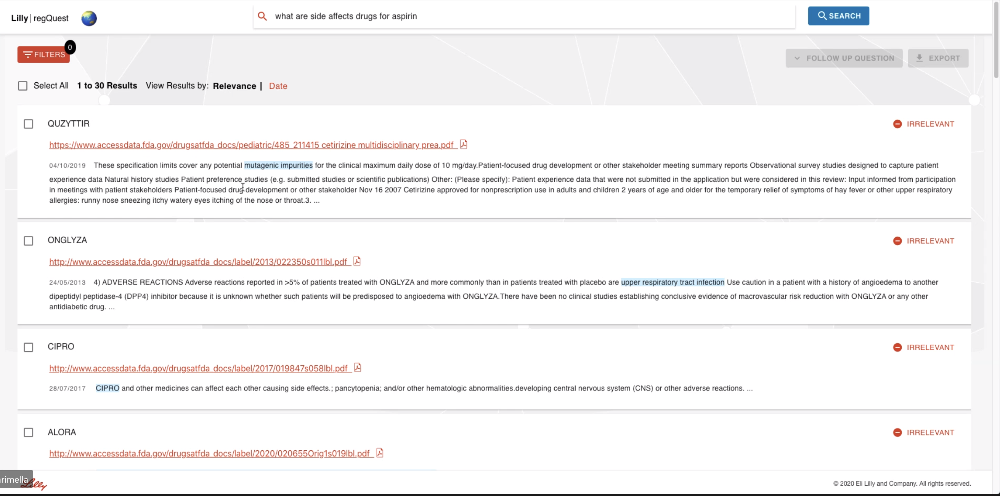

# Text Summarization Using Advanced NLP Methods

A part of this research has started by my team working for [Eli Lilly](https://www.lilly.com/who-we-are/about-lilly) as interns in Summer 2021 and further continued. 
For more information look into the presentation and [contact me](https://github.com/prateeshreddy) for further details

## Lilly RegQuest :
To Provide Cognitive search capability to search against database like FDA and EMA (European medical agency) via a 
natural language question and return relevant results in order to help with accelerating regulatory submissions for [Eli Lilly](https://www.lilly.com/who-we-are/about-lilly)

## Types on Text Summarization :

<b>Extractive Summarization:</b> Rely on the existing text that has phrases, sentences to create a new summary.
So, we need to identify key words or sentences of the existing text.

<b>Abstractive Summarization:</b> Uses advanced NLP techniques to generate an entirely new summary which will not contain phrases or sentences 
that exist in the original text. It is closer to what humans usually expect from text summarization. The process is to understand the original document 
and rephrase the document to a shorter text while capturing the key points.

Example: This type of summarization is what you do while trying to briefly explain about the book you read/ movie you saw to your friend.

## Summarization Algorithms Implemented :

<b> 1. TextRank Algorithm :</b> It is a extractive based summarization algorithm. Similarities between sentence vectors are then calculated and stored in a matrix.
The similarity matrix is then converted into a graph, with sentences as vertices and similarity scores as edges, for sentence rank calculation.
Finally, a certain number of top-ranked sentences form the final summary

<b> 2. BART Transformers :</b>  Bidirectional and Auto-Regressive Transformers is a abstractive summarization algorithm where BERT is a Bidirectional Transformer 
with a Masked Language Modelling uses seq2seq/machine translation architecture. GPT is a autoregressive model which uses left to right decoder.

<b> 3. T5 Transformers :</b> It is a pre-trained abstractive summarization algorithm introduced by Google, 
which also uses Transformers along with the encode-decode approach.Using the model generated from T5ForConditionalGeneration, 
we create the summary IDs, which are further decoded to generate the summary of a particular text.

<b> 4. GPT-2 Algoritm :</b> It is a abstractive summarization algorithm developed by OpenAI which stands for Generative Pre-trained Transformer which uses seq2seq algorithm.
It uses masked self-attention and larger context and vocabulary size.

## Our New Approach: 

Text Summarization Algorithms are very recent cutting edge NLP research it has been dramatically improved after first introduction of 
[attention models and transformer](https://papers.nips.cc/paper/2017/file/3f5ee243547dee91fbd053c1c4a845aa-Paper.pdf). Most of the research is still undergoing.. 

All of the Algorithms mentioned above pick the keywords from the question and search through huge data to form a corpus to then summarize the asked question.

One idea implemented by our team for Eli Lilly is Summarizing by using [BART Question and Answer](https://web.stanford.edu/class/archive/cs/cs224n/cs224n.1194/reports/default/15848021.pdf)
Library to get a corpus of sentences related to the question and then summarizing this corpus instead of the whole data. We believe this will give more accurate summary.

This Approach makes much more sense as it now tries to understand the question and search on relevant data just like a human. At the end of the day Isn't that 
what we are trying to achieve using Deep Learning ? 

## Limitations :

It tries to find words to get a best answer. If the best answer is wrong, it will still produce it. 
Summary Concentrates more on correctness than human readable. We still do not have concrete proof that this works and <b>I wish to further pursue this research</b>
and learn at the same time contribute to the Open Source for the amazing Natural language Processing enthusiasts out here.

## References:

- [BART: Denoising Sequence-to-Sequence Pre-training for NLG](https://arxiv.org/abs/1910.13461) - Mike Lewis, Yinhan Liu, Naman Goyal
- [Transformers In NLP | State-Of-The-Art-Models](https://www.analyticsvidhya.com/blog/2019/06/understanding-transformers-nlp-state-of-the-art-models/) - Analytics Vidhya 
- [BERT for Question Answering on SQuAD 2.0](https://web.stanford.edu/class/archive/cs/cs224n/cs224n.1194/reports/default/15848021.pdf) - Stanford
- [TextRank: Bringing Order into Texts](https://web.eecs.umich.edu/~mihalcea/papers/mihalcea.emnlp04.pdf) - Rada Mihalcea and Paul Tarau (University of Michigan)
- [Attention Is All You Need](https://arxiv.org/abs/1706.03762) - Ashish Vaswani, Noam Shazeer, Niki Parmar

